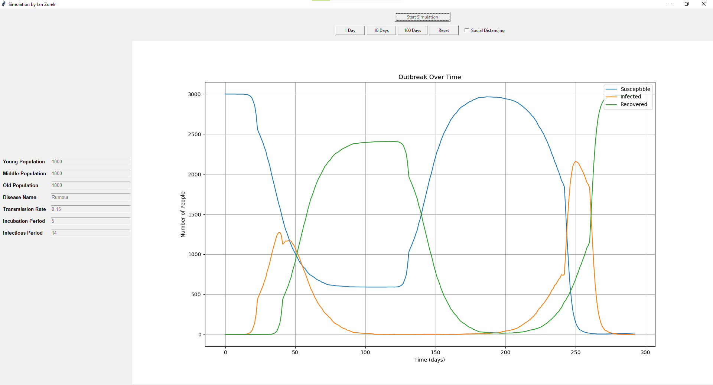

# Epidemic Simulation (Python OOP Project)

A graphical application that simulates the spread of an epidemic in a population, divided into age groups.  
This project was developed as a final assignment for the **Programming 2 (Python)** course and demonstrates the use of **object-oriented programming**, **Tkinter (GUI)**, and **matplotlib** for real-time data visualization.

---

## 📸 Screenshot


---

## 🚀 Features
- Simulation of a population divided into adjustable size age groups (young, adults, elderly).  
- Adjustable epidemic parameters:
  - disease name,  
  - transmission rate,  
  - incubation period,  
  - infectious period.  
- Option to enable/disable **social distancing**.  
- Dynamic real-time chart showing the epidemic course (Susceptible / Infected / Recovered).  
- Reset and restart functionality.  

---

## ⚙️ Installation and Usage

1. Clone the repository:
   ```bash
   git clone https://github.com/zvireek/epidemic-simulation-python.git
   cd epidemic-simulation-python

2. Install dependencies:
   ```bash
   pip install -r requirements.txt

3. Run the application:
   ```bash
   python src/main.py


---

## 🛠 Technologies
- **Python** 3.12
- **TKinter** (GUI)
- **matplotlib** (charts)
- **unittest** (unit testing)


--- 
## 📚 What I Learned

Applying object-oriented programming (classes, interfaces, inheritance).

Developing graphical desktop applications in Python with Tkinter.

Integrating simulation logic with real-time data visualization.

Structuring a project into clean, modular packages.


---
## UML DIAGRAM


